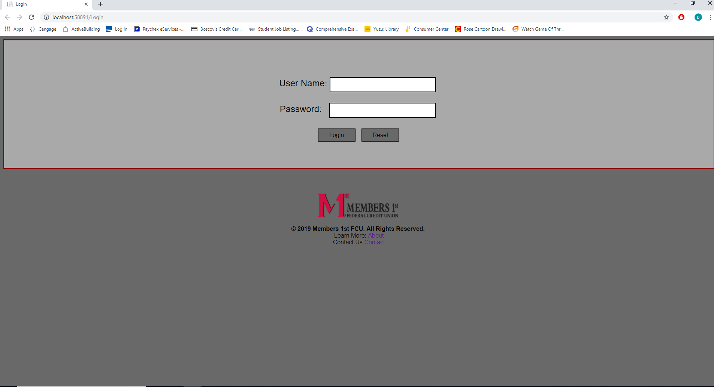

# web_MembersPortal
A website designed to interact with the Members1st API

## 1.0 How to initialize the API:

##### 
Initially set the project port and path to : https://localhost:44394/api/

To query through Postman (and what the website does):

ENDPOINTS:

Profile Information: https://localhost:44394/api/profile

Savings Account: https://localhost:44394/api/Account

Checking Account: https://localhost:44394/api/Checking

Loan Account: https://localhost:44394/api/loan

Certificate: https://localhost:44394/api/certificate

##2.0 How to use the website:

#### This application currently doesn't support an authentication method due to time. There is a login screen and three users are supported:

UserName:DTK13 Password: RK34

UserName:JMax23	Password:JM23

UserName:EP342 Password:EP23

After Logging in with any of the users their account information is pulled into the textboxes/labels. This is done by deserializing the JSON response based on the associated class.

validation is put for the textboxes and a messagebox will appear if there are invalid inputs. (wanted to do more whitelisting as well and commenting throughout the application).

The website should be set to (wanted to to some token authentication, didn't have time):

http://localhost:58891

page will start at : http://localhost:58891/Login, use any of the credentials provided above to test out the API

To Update a profile simply fill in the required fields and hit the update button!

## 3.0 How to Run the Application

First run the api once, then run the website in visual studio, the rest is working fine.

## Screen shots of the app running!

